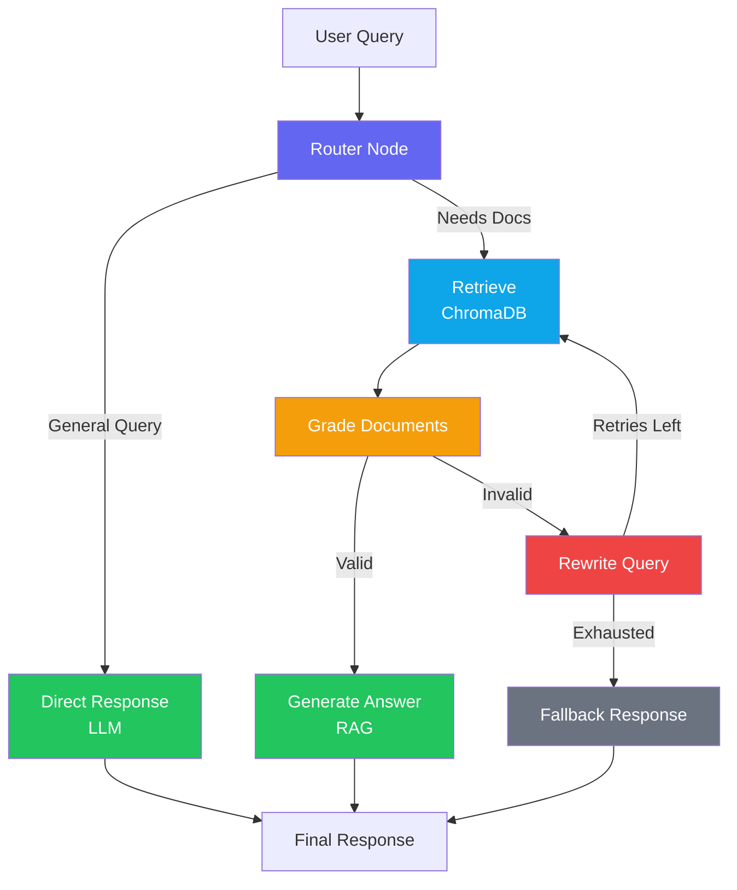

# Vortex — Agentic AI Orchestrator

> A production-ready Agentic RAG Orchestrator architected for Anthropic Claude 3.5 Sonnet, featuring a model-agnostic layer with free tier support for Google Gemini and local Ollama inference.

Vortex is a self-corrective RAG (Retrieval-Augmented Generation) system built on **LangGraph** that dynamically routes queries, evaluates document relevance, rewrites failed searches, and gracefully falls back — all orchestrated as a stateful multi-actor graph.

## Architecture



## Features

- **Self-Corrective RAG** — LangGraph state machine evaluates document relevance before generation, rewrites queries on failure, and falls back gracefully after configurable retries.
- **Intelligent Router** — LLM-based query classifier routes technical questions to the RAG pipeline and general queries to direct response, avoiding unnecessary vector searches.
- **Model-Agnostic Layer** — Seamlessly switch between Google Gemini (free tier), Ollama (local), and Anthropic Claude 3.5 Sonnet via a single environment variable.
- **Local Vector Search** — Embedded ChromaDB with CPU-friendly `all-MiniLM-L6-v2` embeddings for zero-cost semantic search.
- **AI Observability** — OpenTelemetry instrumentation with self-hosted Arize Phoenix for real-time trace visualization of agent decision flows.

## Technology Stack

| Layer | Technology |
|-------|-----------|
| Runtime | Python 3.12 |
| Web Framework | FastAPI (AsyncIO) |
| Agent Framework | LangGraph + LangChain |
| LLM (default) | Google Gemini 2.5 Flash (free tier) |
| LLM (optional) | Anthropic Claude 3.5 Sonnet, Ollama |
| Vector Database | ChromaDB (embedded, on-disk) |
| Embeddings | sentence-transformers/all-MiniLM-L6-v2 |
| Observability | OpenTelemetry → Arize Phoenix |
| CI/CD | GitHub Actions |
| Package Management | uv / pip |

## Quick Start

### 1. Clone and Install

```bash
git clone https://github.com/your-username/vortex.git
cd vortex

# Using uv (recommended)
uv pip install -e ".[dev]"

# Or using pip
pip install -e ".[dev]"
```

### 2. Configure Environment

```bash
cp .env.example .env
# Edit .env with your Gemini API key (free at https://aistudio.google.com/)
```

### 3. Ingest Knowledge Base

```bash
make ingest
```

### 4. Run the Server

```bash
make run
# API available at http://localhost:8000
# Swagger docs at http://localhost:8000/docs
```

### 5. Test the Agent

```bash
# Technical question (RAG pipeline)
curl -X POST http://localhost:8000/chat \
  -H "Content-Type: application/json" \
  -d '{"query": "How do I fix Cortex Error 503?"}'

# General question (direct response)
curl -X POST http://localhost:8000/chat \
  -H "Content-Type: application/json" \
  -d '{"query": "What is 2+2?"}'
```

## Docker Compose (with Phoenix Observability)

```bash
docker compose up -d
```

This starts:
- **Vortex API** at `http://localhost:8000`
- **Arize Phoenix** at `http://localhost:6006` (trace visualization)

## Development

```bash
make lint        # Run ruff linter
make format      # Auto-format code
make typecheck   # Run mypy
make test        # Run pytest
make ci          # Run all checks (lint + typecheck + tests)
```

## Project Structure

```
vortex/
├── src/
│   ├── app/
│   │   ├── main.py               # FastAPI server & routes
│   │   ├── core/
│   │   │   ├── config.py          # Environment configuration
│   │   │   └── llm.py             # LLM provider factory
│   │   ├── graph/
│   │   │   ├── state.py           # AgentState definition
│   │   │   ├── router.py          # LLM-based query classifier
│   │   │   ├── nodes.py           # Graph processing nodes
│   │   │   └── workflow.py        # StateGraph compilation
│   │   └── services/
│   │       └── vector_store.py    # ChromaDB management
│   └── shared/
│       └── schemas.py             # API request/response models
├── data/knowledge_base/           # Cortex/Sentinel markdown manuals
├── scripts/ingest_data.py         # Knowledge base ingestion
├── tests/                         # Unit tests
├── docker-compose.yml             # App + Phoenix stack
├── Makefile                       # Task automation
└── pyproject.toml                 # Dependencies & tooling config
```

## License

Copyright 2026 Davi Laurindo

Licensed under the Apache License, Version 2.0 (the "License");
you may not use this file except in compliance with the License.
You may obtain a copy of the License at

   http://www.apache.org/licenses/LICENSE-2.0

Unless required by applicable law or agreed to in writing, software
distributed under the License is distributed on an "AS IS" BASIS,
WITHOUT WARRANTIES OR CONDITIONS OF ANY KIND, either express or implied.
See the License for the specific language governing permissions and
limitations under the License.