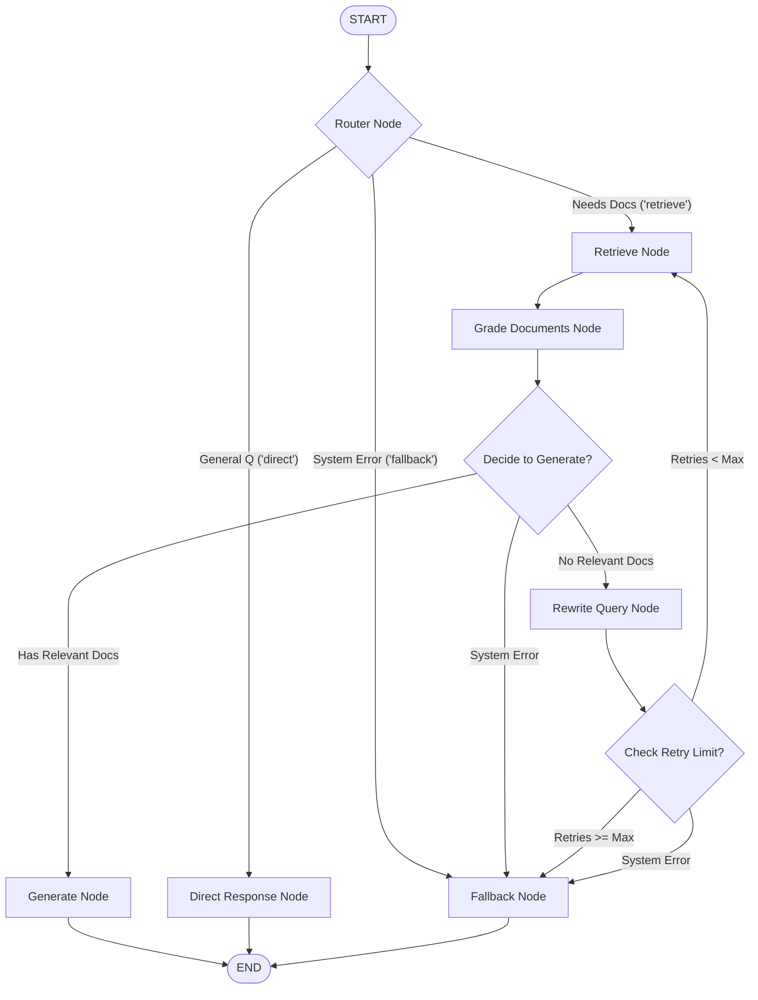

# Vortex — Agentic AI Orchestrator

<p align="center">
  <a href="https://github.com/soneylegal/vortex/actions/workflows/ci.yml">
    
  </a>
  <a href="https://opensource.org/licenses/Apache-2.0">
    
  </a>
  
  
  <a href="https://github.com/astral-sh/ruff">
    
  </a>
  <a href="http://mypy-lang.org/">
    
  </a>
</p>

Vortex is a production-grade, state-of-the-art **Corrective RAG (CRAG) Agentic Orchestrator** designed for automated IT support and troubleshooting. Built on **LangGraph**, it dynamically routes queries, evaluates document relevance, rewrites failed searches, and gracefully falls back — all orchestrated as a stateful, resilient multi-actor graph.

---

## 🗺️ Graph Architecture & Topology

Vortex models the troubleshooting lifecycle as a robust state machine. It evaluates retrieved context before generating answers, rewrites query formulations when searches fail, and routes to fallback modes on system faults:



---

## 🚀 Key Features

*   **Self-Corrective RAG (CRAG)**: LangGraph state machine dynamically grades retrieved documentation relevance, filters out noise, and initiates rewrite loops for failed queries.
*   **Real-time SSE Streaming**: High-performance Server-Sent Events (SSE) streaming API (`POST /api/v1/chat/stream`) yielding token-by-token generation chunks and final structured references.
*   **Multi-Tenant Isolation**: Physical namespace partitioning for ChromaDB collections (`vortex_kb_{tenant_id}`) and dynamic cache lookup isolating tenant context.
*   **In-Memory Ingestion API**: Endpoint (`POST /api/v1/documents`) supporting hot-loading of `.md` and `.pdf` files directly into tenant vector stores.
*   **Bring Your Own Key (BYOK)**: Supports dynamic, request-level API credentials and provider routing via HTTP headers (`Authorization`, `X-API-Key`, `X-Provider`).
*   **Zero-Cost Local Semantic Cache**: Persistent ChromaDB-backed similarity cache using a shared local Sentence-Transformers embeddings model. It features provider-level and tenant-level partition isolation to avoid context leaks.
*   **Chaos Engineering Resilience**: Complete exception shielding across all graph nodes (ChromaDB down, LLM timeouts, grading exceptions) with fast-bypass routing to fallbacks, guaranteeing zero HTTP 500 crashes.
*   **Model-Agnostic Engine**: Native support for Google Gemini, Anthropic Claude, and local Ollama models with seamless environment-level fallback.
*   **Observability**: Integrated OpenTelemetry/OpenInference telemetry compatible with Arize Phoenix for step-by-step agent execution tracing.

---

## 🛠️ Technology Stack

| Layer | Technology | Description |
| :--- | :--- | :--- |
| **Runtime** | Python 3.12 / 3.13 / 3.14 | High-performance async runtime |
| **Web Framework** | FastAPI (AsyncIO) | ASGI web server for fast API delivery |
| **Agent Engine** | LangGraph & LangChain | Stateful multi-actor graph orchestration |
| **Vector Store** | ChromaDB (Embedded) | Persistent vector index for local documents |
| **Embeddings** | `sentence-transformers/all-MiniLM-L6-v2` | CPU-friendly embeddings for zero cost |
| **Observability** | OpenTelemetry + Arize Phoenix | Distributed tracing and LLM evaluation |
| **Build & Tooling** | Hatchling, Ruff, Mypy, pytest | Standardized modern Python developer experience |

---

## 📖 Live Documentation Portal

Vortex includes a fully-featured documentation portal built with **MkDocs-Material**:

```bash
make docs          # Local live-reload server (requires venv)
make docker-docs   # Serve docs inside Docker container
```
Then visit [http://localhost:8001](http://localhost:8001) in your browser.

---

## 🏁 Quick Start

```bash
# 1. Clone and configure
git clone https://github.com/soneylegal/vortex.git
cd vortex
cp .env.example .env   # Fill in your LLM API keys

# 2. Start the full stack
docker compose up -d
```
*   **API Endpoint**: `http://localhost:8000`
*   **Interactive Swagger UI**: `http://localhost:8000/docs`
*   **Phoenix Tracing Dashboard**: `http://localhost:6006`

> For local development without Docker (venv, pip install, manual server), see the [Developer Guide](docs/developer-guide.md).

---

## 🧪 Development & Quality Checks

Maintain repository standards by executing the check suite:

### Local Quality Tools
```bash
make lint        # Run Ruff code linter
make format      # Run Ruff code formatter and check
make typecheck   # Run Mypy static type verification
make test        # Run Pytest suite
make ci          # Run all linting, typechecking, and tests in one command
```

### 🐳 Docker Quality Tools
```bash
make docker-lint        # Lint inside container
make docker-format      # Format inside container
make docker-typecheck   # Typecheck inside container
make docker-test        # Run tests inside container
make docker-ci          # Run all linting, typechecking, and tests inside container
```

---

## 📄 License

Vortex is open-source software licensed under the [Apache License 2.0](LICENSE).