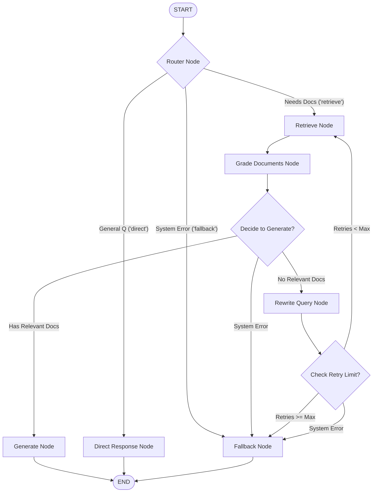

# System Architecture & Graph Topology

Vortex employs a stateful **Corrective RAG (CRAG)** design pattern modeled as an agentic state machine using **LangGraph**. This architecture allows the system to evaluate the relevance of retrieved documents, perform query rewriting when documents are insufficient, and enforce strict loop protection and fallback paths.

---

## 🗺️ Graph Topology

Below is the state machine representation of the Vortex orchestrator. It illustrates how incoming queries are routed, verified, rewritten, and protected from system errors:



---

## 🧠 State Representation (`AgentState`)

The workflow maintains a single state object, `AgentState` (`TypedDict`), which is passed and updated between nodes:

```python
class AgentState(TypedDict):
    question: str                 # The user's query (potentially rewritten)
    generation: str               # The final generated response
    documents: list[Document]     # Retrieved and filtered knowledge documents
    steps: list[str]              # Execution steps for auditability and tracing
    route: str                    # Router classification ("retrieve", "direct", "fallback")
    retry_count: int              # Counter protecting against infinite loops
    api_key: NotRequired[str]     # Dynamic client-provided API key
    provider: NotRequired[str]    # Selected model provider (gemini, anthropic, ollama)
    error: NotRequired[str]       # Error message propagated to fallback nodes
```

---

## 🧱 Workflow Nodes & Operations

### 1. Router Node (`router_node`)
Classifies incoming queries into technical support questions needing retrieval (`retrieve`) or general conversational questions (`direct`).
*   **Implementation**: Utilizes structured LLM outputs (`RouteDecision` schema).
*   **Error Handling**: If the LLM call fails, the node sets `route` to `"fallback"` and populates the `error` state.

### 2. Retrieve Node (`retrieve_node`)
Queries the local ChromaDB vector store for documents related to the current question.
*   **Implementation**: Performs vector search using `HuggingFaceEmbeddings` distance search.
*   **Error Handling**: Captures any connection errors to ChromaDB, clears document state, and sets `error` to trigger fallback routing.

### 3. Grade Documents Node (`grade_documents_node`)
Performs a binary relevance check on each retrieved document.
*   **Implementation**: A structured LLM call scores each document as `"yes"` (relevant) or `"no"` (irrelevant). Only `"yes"` documents are kept.
*   **Skip Condition**: If an error is already present in the state, the node immediately passes through.

### 4. Rewrite Query Node (`rewrite_query_node`)
Optimizes the search query when retrieved documents are found irrelevant.
*   **Implementation**: Employs an LLM rewriter to reformulate the query for higher recall.
*   **Safety**: Increments the `retry_count` in the state.

### 5. Generate Node (`generate_node`)
Synthesizes the final response using the user's question and relevant retrieved context.
*   **System Prompt**: Enforces boundaries, instructing the LLM to only answer based on context and state if it doesn't know the answer.

### 6. Fallback Node (`fallback_node`)
The terminal safety node. Returns a polite, helpful explanation to the user.
*   **Dual Mode**: Differentiates between a *knowledge base miss* (no docs found after retries) and a *system exception* (e.g., ChromaDB offline, LLM api timeouts).
